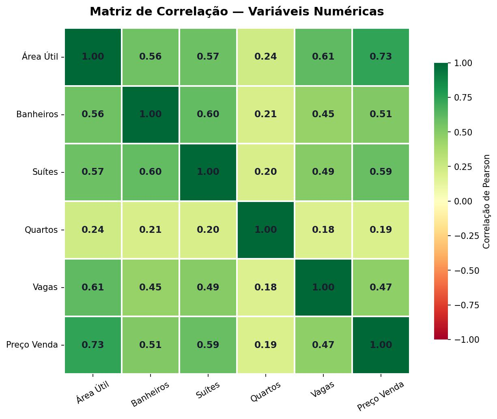
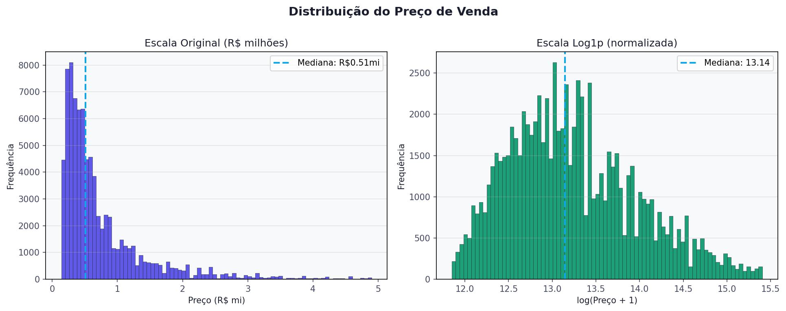
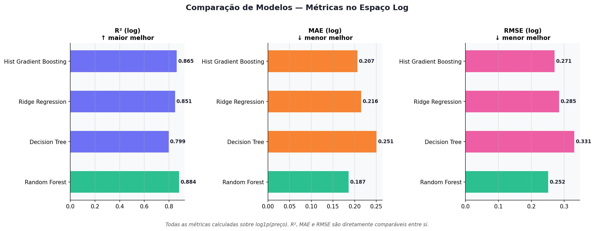
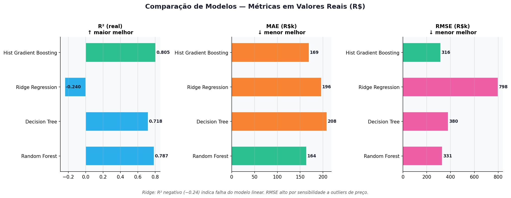
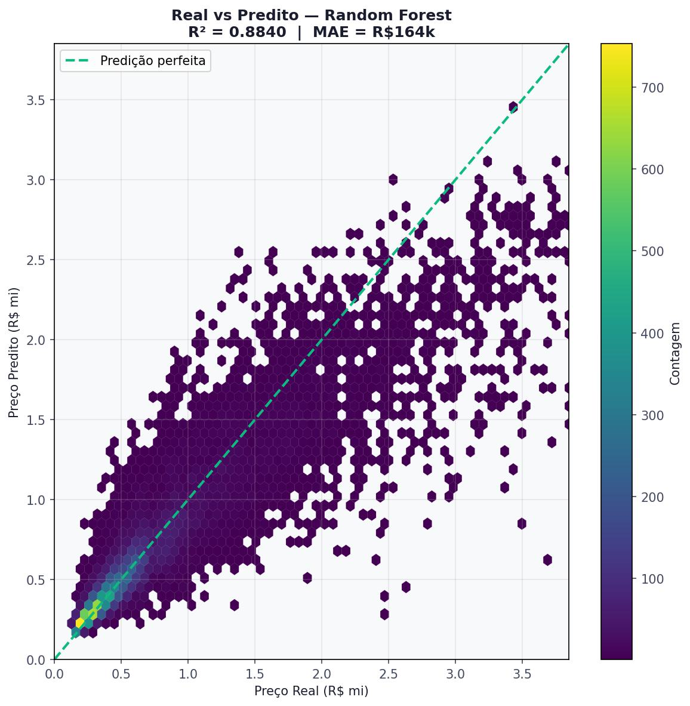

# analise-imoveis-sp
# 🏠 Análise de Imóveis em São Paulo

Projeto de **análise exploratória de dados + machine learning** para prever preços de imóveis em São Paulo.

---

## 📌 Objetivo

Explorar fatores que influenciam o preço de imóveis e construir modelos preditivos para estimar valores de venda com base em características como:

* Área útil
* Número de quartos
* Banheiros
* Suítes
* Vagas de garagem
* Tipo de imóvel
* Bairro

---

## 📊 Etapas do projeto

### 1. Limpeza e preparação dos dados

* Base de dados utilizada: [São Paulo House Prices](https://www.kaggle.com/datasets/ex0ticone/house-prices-of-sao-paulo-city)
* Remoção de valores inconsistentes e outliers
* Tratamento de valores nulos
* Conversão de variáveis categóricas

### 2. Análise exploratória (EDA)

* Distribuição dos preços
* Correlação entre variáveis
* Análise por tipo de imóvel
* Comparação entre bairros

### 3. Modelagem de Machine Learning

Modelos utilizados:

* Random Forest
* Decision Tree
* Ridge Regression
* HistGradient Boosting

### 4. Avaliação dos modelos

Métricas utilizadas:

* R² (log)
* MAE (erro absoluto médio)
* RMSE (erro quadrático médio)

---

## 📈 Principais insights

* Área útil é uma das variáveis mais fortes para previsão de preço
* Bairros apresentam grande variação de valor mediano
* Modelos baseados em árvores tiveram melhor performance
* Distribuição de preços é altamente assimétrica (necessidade de log)

---

## 📷 Exemplos de gráficos

### Correlação entre variáveis



### Distribuição de preços



### Comparação de modelos




### Preço real vs previsto



---

## 🧠 Tecnologias utilizadas

* Python 🐍
* Pandas
* NumPy
* Matplotlib
* Seaborn
* Scikit-learn

---

## 📁 Estrutura do projeto

```
projeto-imoveis/
│
├── notebooks/        # notebooks Jupyter
├── images/           # gráficos exportados
├── data/             # dataset (não versionado)
├── README.md
└── requirements.txt
```


## 🚀 Possíveis melhorias futuras

* Uso de SHAP para interpretabilidade dos modelos
* Modelos mais avançados (XGBoost / LightGBM)
* Deploy com Streamlit ou API
* Geolocalização dos imóveis

---
